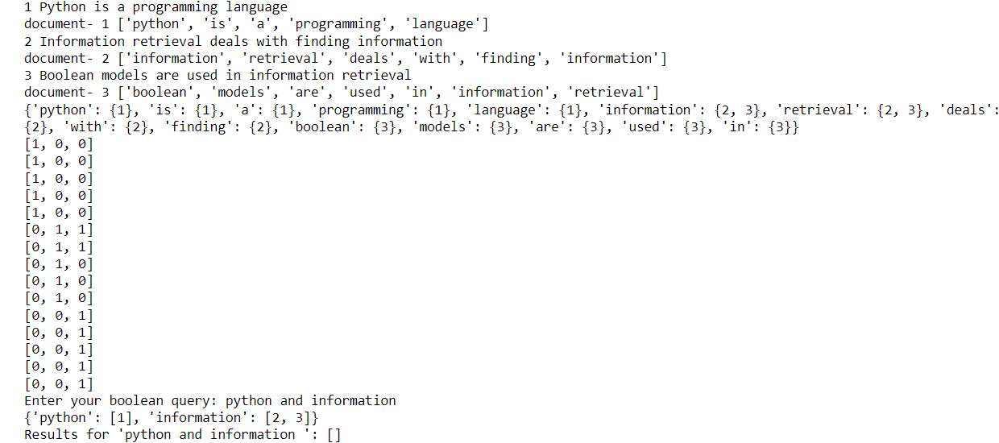
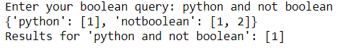

### EX5 Information Retrieval Using Boolean Model in Python

### DATE: 23/3/24

### AIM: To implement Information Retrieval Using Boolean Model in Python.

### Description:

<div align = "justify">
The Boolean model in Information Retrieval (IR) is a fundamental model used for searching and retrieving information from a collection of documents. It operates on the principles of set theory and logic, where documents are represented as sets of terms or words, and queries are expressed as Boolean expressions using logical operators such as AND, OR, and NOT.
  
### Procedure:
1. ***Initialize the BooleanRetrieval class:*** The BooleanRetrieval class is defined to manage the indexing and searching of documents.
2. ***Constructor and Index Initialization:*** The class constructor initializes an empty index to store the inverted index mapping terms to documents.
3. ***Indexing Documents:***
    <p> a) The index_document method is responsible for indexing documents.
    <p> b) Tokenize the text content of documents, converting them into lowercase terms.
    <p> c) For each term in the document, it adds an entry in the index, associating the term with the document ID. </p>
4. ***Fetch Web Page Text:***
    <p>a) The fetch_webpage_text method uses the requests library to fetch content from a given URL.
    <p>b) Extract text content from the fetched HTML using BeautifulSoup.
    <p>c) The extracted text is returned for further processing.
5. ***Boolean Search:***
    <p>a) The boolean_search method performs Boolean searches on the indexed documents.
    <p>b) Tokenize the input query and iterates through its terms.
    <p>c) For each term in the query, it retrieves documents containing that term and performs Boolean operations (AND, OR, NOT) based on the query's structure.

### Program:

```
class index:
    matrix = []
    index = {}
    def index_document(self, doc_id, text):
        terms = text.lower().split()
        print("document-", doc_id, terms)
        for term in terms:
            if term not in self.index:
                self.index[term] = set()
            self.index[term].add(doc_id)

    def create_documents_matrix(self, documents):
        self.matrix = [[0]*len(documents) for _ in range(len(self.index)) ]
        print(self.index)
        ind = 0
        for i in self.index:
            for j in self.index[i]:
                self.matrix[ind][j-1] = 1
            ind += 1


    def print_documents_matrix_table(self):
        for i in self.matrix:
            print(i)
    def boolean_search(self, query):
        tokens = query.lower().split()
        key_tokens = []
        con = []
        d = {}
        i = 0
        while i < len(tokens):
            if tokens[i] == 'and':
                con.append('and')
            elif tokens[i] == 'or':
                con.append('or')
            elif tokens[i] == 'not':
                d['not'+tokens[i+1]] = []
                for ind in range(1,4):
                    if ind not in self.index[tokens[i+1]]:
                        d['not' + tokens[i+1]] += [ind]
                i+=1
            else:
                d[tokens[i]] = []
                for ind in range(1,4):
                    if ind in self.index[tokens[i]]:
                        d[tokens[i]] += [ind]
            i+=1
        print(d)
        temp = []
        for i,j in d.items():
            temp.append(j)
        res = temp[0]
        for i in temp:
            res = list(set(res).intersection(i))
        return res

```

# Example usage:

```
# Indexing documents
documents = {
    1: "Python is a programming language",
    2: "Information retrieval deals with finding information",
    3: "Boolean models are used in information retrieval"
}
indexer = index()
for doc_id, text in documents.items():
    print(doc_id,text)
    indexer.index_document(doc_id, text)

# Create a matrix of zeros and ones
indexer.create_documents_matrix(documents)
indexer.print_documents_matrix_table()

# Print all terms in the documents
# indexer.print_all_terms()

# Boolean search
query1 = input("Enter your boolean query: ")
print(f"Results for '{query1}': {indexer.boolean_search(query1)}")
```

### Output:




### Result:

Thus the pyhton program to implement Information Retrieval Using Boolean Model is completed successfully
